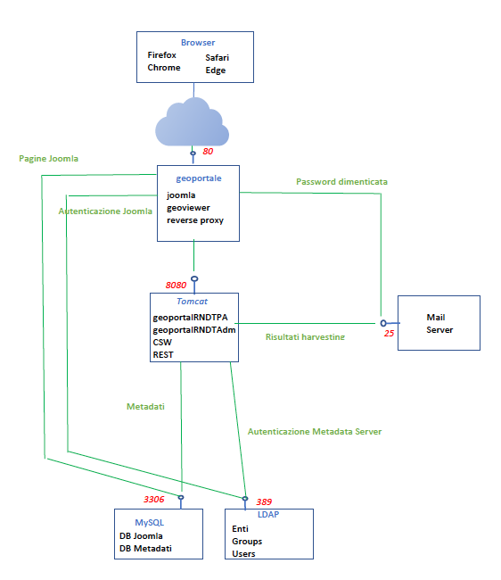

# RNDT 2.0

La suite RNDT 2.0 è un insieme di applicazioni per l'implementazione di un Geoportale che include un potente motore di ricerca, visualizzazione e gestione di metadati secondo le regole tecniche nazionali ed europee (INSPIRE), oltre a un visualizzatore di dati e servizi.

La suite è utilizzata dal [**portale RNDT**](https://geodati.gov.it).

Essa si basa su un CMS (Joomla) per la gestione dei contenuti e delle pagine informative, un DB (MySQL) per la gestione dei contenuti sia gestionali che relativi ai metadati (v. lo [**schema dati**](data-schema.md)), un server di autenticazione (LDAP), un metadata server (ESRI Geoportal Server) per la gestione dei metadati e un geoviewer.

Il sistema è installabile sia in ambiente Windows che in ambiente Linux, in quanto scritto in linguaggio Java/PHP e operante all&#39;interno di un application container (Tomcat).

Il sistema è stato creato per la realizzazione del nuovo geoportale RNDT di AgID ed ha quindi alcune caratteristiche che derivano principalmente dai requisiti di progetto con particolare riferimento a:

- Gestione di Enti e Utenti
- Suddivisione tra funzionalità per utenti generici, applicazione "PA" e applicazione di "Amministrazione".

Il sistema consiste nelle seguenti componenti:

- **Geoportale**: applicazione Joomla/PHP per la gestione dei contenuti del sito; 
- **Geoviewer**: applicazione Javascript di un visualizzatore che consente di ricercare e visualizzare risorse geografiche disponibili sul Web;
- **Reverse proxy**: questo non è un vero e proprio componente ma è una modalità per instradare le chiamate alle webapp e impedire quindi l&#39;accesso diretto alla macchina di backend. Tutte le chiamate all&#39;interfaccia RST e CSW delle webapp devono essere instradate dalla porta 80 alla porta 8080 su tomcat;
- **geoportalRNDTPA** / **geoportalRNDTAdm**: webapp per la gestione dei metadati, una per la gestione e pubblicazione dei metadati e l'altra che include anche le funzionalità di amministrazione;
- **Database Joomla** / **Database Metadati**: i due schemi MySQL che gestiscono i contenuti del CMS e i metadati;
- **LDAP**: server di autenticazione che viene utilizzato da Joomla e dalle webapp.

Per la gestione del sistema sono inoltre necessarie alcune applicazioni di gestione dei componenti base, quali:

- _MySQL Workbench_: per la gestione del database MySQL
- _Apache Directory Studio_: per la gestione del server LDAP
- _Joomla Administrator_: per la gestione delle pagine Joomla

Nella figura seguente viene mostrata una delle possibili architetture del sistema: ovviamente è anche possibile avere tutte le componenti su una sola macchina, oppure creare dei cluster per MySQL o LDAP o duplicare il front-end per ragioni di bilanciamento e fault tolerance.

## Distribuzioni

Le componenti di cui sopra sono rese disponibili nei seguenti respository:

- [**geoportale**](https://github.com/AgID/rndt-joomla-template);
- [**geoviewer**](https://github.com/AgID/rndt-geoviewer), che include anche gli applicativi per il reverse proxy;
- [**catalogo metadati**](https://github.com/AgID/rndt-catalogue), che comprende le due webapp geoportalRNDTPA e geoportalRNDTAdm, LDAP e il DB per i metadati.

Altre applicazioni relative a RNDT disponibili per il riuso sono le seguenti:
- [**RNDT metadata converter**](https://github.com/AgID/rndt-md-converter), tool per la trasformazione dei metadati da un profilo ISO 19115 / TS 19139 ad un altro;
- [**RNDT GeoDCAT-AP API**](https://github.com/AgID/rndt-geodcat-ap-api), soluzione per trasformare i metadati dei dati territoriali documentati secondo il profilo italiano dallo standard ISO TS 19139 allo standard DCAT-AP/DCAT-AP_IT.

## Licenza

Le componenti della suite sono rese disponibili con **licenza EUPL v.1.2**, come indicato nei singoli repository.

## Credits

La suite è stata sviluppata da ESRI Italia per [**AgID**](https://agid.gov.it/) nell'ambito della gara per le **Infrastrutture Nazionali Condivise SPC**.
