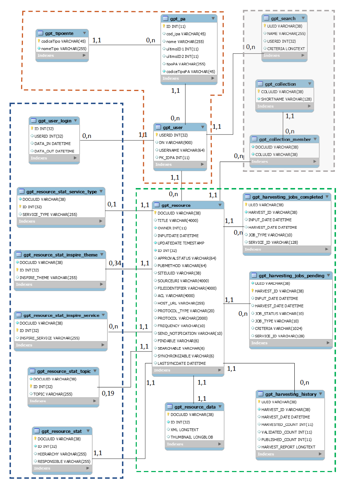

# Schema dati

L'immagine che segue rappresenta lo schema ER del database suddiviso nelle seguenti aree:

- **Area con contorno verde** : sono le tabelle che contengono i metadati e la relazione con le raccolte effettuate. Queste tabelle fanno parte del prodotto base Esri Geoportal Server e vengono utilizzate nel sistema;
- **Area grigia** : sono le tabelle che gestiscono le collezioni e le ricerche utenti salvate. Anch'esse fanno parte del prodotto base Esri Geoportal Server ma non vengono utilizzate nel sistema;
- **Area con contorno marrone** : sono le tabelle per la gestione delle pubbliche amministrazioni, della loro tipologia e del legame con gli utenti. A parte la tabella GPT_USER, sono tabelle aggiuntive create appositamente per il progetto. La tabella GPT_USER è stata modificata rispetto a quella originaria con l&#39;aggiunta del legame con la PA, attributo FK_IDPA;
- **Area con contorno blu** : sono le tabelle per le statistiche, create appositamente per il progetto.

Di  seguito verranno descritte solo le tabelle principali con i loro campi.

### GPT_HARVESTING_HISTORY

Tabella che lega un metadato di un catalogo ai suoi jobs di raccolte completate.

| **Column Name** | **Meaning** |
| --- | --- |
| UUID | Unique string associated with each harvesting history record |
| HARVEST\_ID | ID of the repository that was harvested (DOCUUID del metadato che è un catalogo) |
| HARVEST\_DATE | Date of the harvest |
| HARVESTED\_COUNT | Number of documents harvested (duplicated from harvest\_report column for better performance and sorting) |
| VALIDATED\_COUNT | Number of harvested documents that were valid (duplicated from harvest\_report column for better performance and sorting) |
| PUBLISHED\_COUNT | Number of harvested documents that were published to the portal (duplicated from harvest\_report column for better performance and sorting) |
| HARVEST\_REPORT | Information that will be displayed for the harvesting report text |

### GPT_HARVESTING_JOBS_COMPLETED

Tabella che lega un metadato di un catalogo ai suoi jobs di raccolte completate senza le informazioni relative ai record raccolti.

| **Column Name** | **Meaning** |
| --- | --- |
| UUID | Unique string associated with each completed harvesting job |
| HARVEST\_ID | ID of the repository that was harvested in that job (DOCUUID del metadato che è un catalogo) |
| INPUT\_DATE | Date and timestamp marking when the harvesting job was created. This is the same INPUT\_DATE that is in the GPT\_HARVESTING\_JOBS\_PENDING table |
| HARVEST\_DATE | Date and timestamp for when the harvesting job was completed. This is the same HARVEST\_DATE that is in the GPT\_HARVESTING\_JOBS\_PENDING table |
| JOB\_TYPE | Harvesting job type (e.g., &quot;full&quot;=Full Harvest or &quot;now&quot;= Harvest Records that have been updated since last harvest. Same JOB\_TYPE that is in the GPT\_HARVESTING\_JOBS\_PENDING table |
| SERVICE\_ID | The Harvesting Service ID of the Harvesting Service that took over the job. |

### GPT_HARVESTING_JOBS_PENDING

Tabella che lega un metadato di un catalogo ai suoi jobs di raccolte in corso. Il record viene cancellato quanto la raccolta è completata.

| **Column Name** | **Meaning** |
| --- | --- |
| UUID | Unique string associated with each pending harvesting job |
| HARVEST\_ID | ID of the repository that will be harvested in this job (DOCUUID del metadato che è un catalogo) |
| INPUT\_DATE | Date and timestamp marking when the harvesting job was created. This is the same INPUT\_DATE that is in the GPT\_HARVESTING\_JOBS\_COMPLETED table |
| HARVEST\_DATE | Date and timestamp for when the harvesting job was completed. This is the same HARVEST\_DATE that is in the GPT\_HARVESTING\_JOBS\_COMPLETED table |
| JOB\_STATUS | Status of the harvesting job (e.g., &quot;submitted&quot; or &quot;running&quot;) |
| JOB\_TYPE | Harvesting job type (e.g., &quot;full&quot;=Full Harvest or &quot;now&quot;= Harvest Records that have been updated since last harvest. Same JOB\_TYPE that is in the GPT\_HARVESTING\_JOBS\_COMPLETED table |
| CRITERIA | XML string that defines the saved search |
| SERVICE\_ID | The Harvesting Service ID of the Harvesting Service that will take over the job. Its ID is defined through the Harvesting Service install wizard (e.g., GPT\_Harvesting\_Service). |

### GPT_RESOURCE

Tabella principale dei metadati. Contiene i dati essenziali per ogni metadato e il legame con il proprietario.

| **Column Name** | **Meaning** |
| --- | --- |
| DOCUUID | Unique string associated with each resource |
| TITLE | Title of the resource (Presa dal tag **title)** |
| OWNER | UserID of the user who has ownership of the document. Corresponds to USERID in the GPT\_USER table |
| INPUTDATE | Date resource was registered |
| UPDATEDATE | Date resource was last updated |
| ID | Number assigned to registered resources to provide backward compatibility with the Geoportal 9.3.x harvesting mechanisms **Note: DOCUUID vs. ID:** DOCUUID is used to uniquely identify resources. ID, being a numerical value, is also used because certain database operations are faster on numerical values. If you are migrating a Geoportal 9.3.x database to Geoportal Server, migration will extract the metadata xml out of the 9.3.x GPT\_METADATA table to the Geoportal Server&#39;s GPT\_RESOURCE\_DATA table. Both GPT\_RESOURCE and GPT\_RESOURCE\_DATA are linked together using the ID for performance on UPDATE requests. For searching, and reading/downloading raw metadata, the DOCUUID is better to use. Maintaining both the ID and the DOCUUID for resources is a balance that maintains backward compatibility, usability, and increases performance. |
| APPROVALSTATUS | Indicates if resource is approved (&quot;approved&quot;=approved, &quot;NULL&quot;= not approved, record has any other status) |
| PUBMETHOD | How the resource was published to the portal (e.g. &quot;upload&quot;, &quot;registration&quot;, &quot;harvester&quot; (synchronization), &quot;batch&quot;, &quot;editor&quot;) |
| SITEUUID | If the resource is synchronized, this is the site identifier string of the registered resource from which it came. |
| SOURCEURI | User id and originating filename/location of the resource |
| FILEIDENTIFIER | Value that may be stored in the resource&#39;s metadata xml to distinguish it from other resources (tag **fileIdentifier** ). Because not every record may have a FileIdentifier in its XML, the geoportal assigns the DOCUUID to uniquely identify each record |
| ACL | Indicates the restriction policy (if any) on the record. NON UTILIZZATO. |
| HOST\_URL | If the resource is a registered network resource, this is its URL |
| PROTOCOL\_TYPE | If the resource is a registered network resource, this is the protocol it uses (e.g., &quot;arcims&quot;, &quot;res&quot;, &quot;csw&quot;, &quot;oai&quot;, &quot;waf&quot;, &quot;thredds&quot;) |
| PROTOCOL | Xml encoding of the resource&#39;s parameters, as defined when the resource is registered. An example with WAF: \&lt;?xml version=&quot;1.0&quot; encoding=&quot;UTF-8&quot;?\&gt;\&lt;protocol type=&quot;WAF&quot;\&gt;\&lt;username/\&gt;\&lt;password/\&gt;\&lt;/protocol\&gt; |
| FREQUENCY | How often the resource should be synchronized (e.g., &quot;Monthly&quot;, &quot;BiWeekly&quot;, &quot;Weekly&quot;, &quot;Daily&quot;, &quot;Hourly&quot;, &quot;Once&quot;, &quot;Skip&quot;) |
| SEND\_NOTIFICATION | True/false: send user an email when resource is synchronized |
| FINDABLE | String associated with each metadata record, indicating whether it can be found when searching for metadata. The value can either be null for metadata that is not describing a searchable endpoint or true or false for metadata records that are describing a searchable endpoint. |
| SEARCHABLE | String associated with each metadata record indicating whether to include the resource in the distributed search list. The value can either be null for metadata that is not describing a searchable endpoint or true or false for metadata records that are describing a searchable endpoint. |
| SYNCHRONIZABLE | String associated with each metadata record indicating whether the content can be synchronized. The value can either be null for metadata that is not describing a searchable endpoint or true or false for metadata records that are describing a searchable endpoint. |
| LASTSYNCDATE | Date resource was last synchronized. Viene utilizzata per la raccolta incrementale. |

### GPT_RESOURCE_DATA

Tabella che contiene l&#39;XML del metadato. È in relazione 1,1 con gpt_resource_data ed è separata solo per ragioni di ottimizzazione.

| **Column Name** | **Meaning** |
| --- | --- |
| DOCUUID | Unique string associated with each metadata record, connecting this table to the GPT\_RESOURCE table |
| ID | Number assigned to registered resources to provide backward compatibility with the Geoportal 9.3.x harvesting mechanisms |
| XML | complete xml of the metadata record |
| THUMBNAIL | stored image associated with the thumbnail graphic for records containing binary image information in the metadata xml |

### GPT_SEARCH

Tabella per memorizzare le ricerche salvate degli utenti.

**NON UTILIZZATA**

| **Column Name** | **Meaning** |
| --- | --- |
| UUID | Unique string associated with each saved search |
| NAME | Name of the saved search |
| USERID | UserID of the user who saved the search |
| CRITERIA | XML string that defines the saved search |

### GPT_USER

Tabella che contiene gli utenti. Un utente viene registrato in questa tabella al suo primo accesso al sistema. Vengono registrati solo alcuni dati essenziali; la password e gli altri dati sono in LDAP.

| **Column Name** | **Meaning** |
| --- | --- |
| USERID | Unique number assigned to each user |
| DN | Full LDAP distinguished name (e.g., cn=gptadmin,ou=users,ou=system) |
| USERNAME | Username (e.g., gptadmin) |

### GPT_COLLECTION

Tabella delle collezioni.

**NON UTILIZZATA**

| **Column Name** | **Meaning** |
| --- | --- |
| COLUUID | Unique string associated with each collection |
| SHORTNAME | Name of the collection |

### GPT_COLLECTION_MEMBER

Tabella che lega una collezione ai metadati che ne fanno parte (E&#39; una relazione 1 a molti).

**NON UTILIZZATA**

| **Column Name** | **Meaning** |
| --- | --- |
| DOCUUID | Document UUID of the record in the collection |
| COLUUID | Collection ID of the collection containing the document |

### GPT_PA

Tabella che contiene le PA.

| **Column Name** | **Meaning** |
| --- | --- |
| ID | Identificativo univoco (Sequence) |
| COD\_IPA | Codice IPA della PA |
| NOME | Nome ufficiale della PA |
| ULTIMOID1 | Ultimo progressivo assegnato automaticamente (Editor) per l&#39;identificativo di un metadato |
| ULTIMOID2 | Ultimo progressivo assegnato automaticamente (Editor) per l&#39;identificativo di un dato |
| TIPOPA | Tipo PA (Nome del Tipo, copia di GPT\_TIPOENTE.NOMETIPO) |
| CODICETIPOPA | Codice del tipo PA |

### GPT_TIPOENTE

Tabella che contiene le tipologie dell'Ente.

| **Column Name** | **Meaning** |
| --- | --- |
| CODICETIPO | Codice del tipo PA |
| NOMETIPO | Nome del Tipo di PA |

### GPT_USER_LOGIN

Tabella che tiene traccia degli accessi da parte di un utente. Se l&#39;utente non si scollega correttamente dal sistema (logout) il campo DATA_OUT rimane vuoto.

| **Column Name** | **Meaning** |
| --- | --- |
| ID | Identificativo univoco del record (sequence) |
| USERID | Identificativo dell&#39;utente |
| DATA\_IN | Timestamp del login |
| DATA\_OUT | Timestamp del logout |

### GPT_RESOURCE_STAT

Tabella di statistiche che tiene traccia del tipo di metadato (dataset, serie, servizio, nuove_acquisizioni) e della PA responsabile per quel metadato. La tabella viene gestita automaticamente ad ogni inserimento/cancellazione/aggiornamento di un metadato.

| **Column Name** | **Meaning** |
| --- | --- |
| ID | Identificativo univoco del record (sequence) |
| DOCUUID | Identificativo del metadato |
| HIERARCHY | Tipo di metadato |

### GPT_RESOURCE_STAT_TOPIC

Tabella di statistiche che tiene traccia della categoria ISO. La tabella viene gestita automaticamente ad ogni inserimento/cancellazione/aggiornamento di un metadato.

| **Column Name** | **Meaning** |
| --- | --- |
| ID | Identificativo univoco del record (sequence) |
| DOCUUID | Identificativo del metadato |
| TOPIC | Categoria ISO |

### GPT_RESOURCE_STAT_INSPIRE_SERVICE

Tabella di statistiche che tiene traccia del tipo di servizio INSPIRE. La tabella viene gestita automaticamente ad ogni inserimento/cancellazione/aggiornamento di un metadato.

| **Column Name** | **Meaning** |
| --- | --- |
| ID | Identificativo univoco del record (sequence) |
| DOCUUID | Identificativo del metadato |
| INSPIRE\_SERVICE | Tipo di servizio INSPIRE |

### GPT_RESOURCE_STAT_INSPIRE_THEME

Tabella di statistiche che tiene traccia del tema INSPIRE. La tabella viene gestita automaticamente ad ogni inserimento/cancellazione/aggiornamento di un metadato.

| **Column Name** | **Meaning** |
| --- | --- |
| ID | Identificativo univoco del record (sequence) |
| DOCUUID | Identificativo del metadato |
| INSPIRE\_THEME | Tema INSPIRE |

### GPT_RESOURCE_STAT_SERVICE_TYPE

Tabella di statistiche che tiene traccia del tipo di servizio (discovery, view, download, transformation, invoke). La tabella viene gestita automaticamente ad ogni inserimento/cancellazione/aggiornamento di un metadato.

| **Column Name** | **Meaning** |
| --- | --- |
| ID | Identificativo univoco del record (sequence) |
| DOCUUID | Identificativo del metadato |
| SERVICE\_TYPE | Tipo di servizio |
